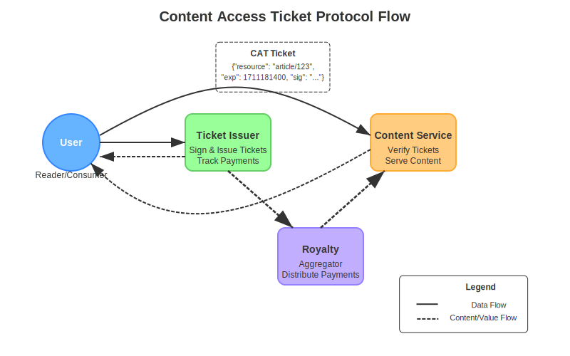

# Content Access Ticket Protocol (CAT Protocol) - Specification

**Version**: 0.2-Draft

---

### Overview

The CAT Protocol enables decentralized, signed, time-limited access to paywalled or premium content by issuing verifiable tickets. These tickets are cryptographically signed and can be redeemed across media partners, ensuring seamless value flow and user privacy.

It aims to address today's fragmented, siloed, and inequitable content access models by introducing an open, interoperable royalty protocol that benefits creators, publishers, and audiences alike.

---

### The Problem: Content Access in the Current Digital Economy

-   **Fragmented Paywalls**: Each publisher or platform maintains its own subscription system, often leading to user fatigue and abandoned subscriptions.
-   **Information Inequity**: Only users with sufficient financial means can afford access to quality content, worsening the digital divide.
-   **Micropayment Gaps**: Existing micropayment models have failed to reach scale due to user friction, lack of interoperability, and poor UX.
-   **Advertising Dependence**: Many outlets are forced to prioritize clickbait for ad revenue, compromising journalistic quality and trust.
-   **Subscription Saturation**: Users face cognitive and financial overload with too many fragmented content silos requiring separate logins and monthly payments.
-   **Data Silos & Lock-in**: Each content provider controls access logs, user identity, and payment flows — limiting cross-platform innovation and collaboration.

---

### Protocol Flow Diagram

The following diagram illustrates the key stakeholders and workflow of the CAT Protocol:



1. User requests and pays for access to content
2. Ticket Issuer signs and returns a CAT ticket
3. User presents the ticket to the Content Service
4. Content Service returns the requested content
5. Content Service logs the access for royalty tracking
6. Royalties are distributed to content creators and publishers

---

### Use Cases

-   Reading paywalled articles (e.g. WSJ, NYT)
-   Streaming licensed music or video
-   Accessing eBooks page-by-page or chapter-by-chapter
-   Gated API access or downloadable data assets

---

### Key Principles

-   **Cryptographic Signature**: Each ticket is signed by a trusted identity (issuer or platform).
-   **Timestamp Bound**: Tickets are valid only for a short time window.
-   **Chunkable**: Content access can be segmented and streamed.
-   **Interoperable**: Works across participating CMSs and platforms.
-   **Verifiable**: Public key cryptography allows fast stateless validation.
-   **Open Market Logic**: Anyone can issue, verify, or redeem tickets without centralized control.
-   **Royalty Accountability**: Redemption logs can feed into transparent revenue distribution.

---

### Ticket Format (JSON)

```json
{
  "resource": "https://example.com/article/abc123",
  "ts": 1711180800,
  "exp": 1711181400,
  "chunk": "1",
  "pubkey": "npub1xyz...",
  "sig": "<signature>"
}
```

#### Fields

-   `resource`: Full URL or content identifier (slug, hash, etc.)
-   `ts`: Unix timestamp when the ticket was issued
-   `exp`: Expiration timestamp (suggested: now + 5 min)
-   `chunk`: Optional chunk or segment ID (page, byte range, time window)
-   `pubkey`: Issuer's public key (Bech32 for Nostr, or base58/base64 if using Ed25519)
-   `sig`: Signature over the stringified payload (excluding `sig`)

---

### Signing & Verification

-   Sign using Schnorr (secp256k1) or Ed25519 private key
-   Payload to be signed is a deterministic stringified JSON with sorted keys (excluding `sig`)
-   Verification involves checking:
    -   Valid signature
    -   Expiration not passed
    -   Optional: ticket redemption limits, IP match, or payment proof

---

### Redemption Flow

1.  Client requests access to a protected resource
2.  Issuer verifies eligibility (user payment, rights, quota)
3.  Issuer signs ticket and sends it to client (e.g. URL query param or HTTP header)
4.  Client sends ticket to content provider
5.  Provider verifies ticket and grants access if valid
6.  Provider optionally logs for royalty accounting

---

### Backend Integration

-   CMS plugins should support:
    -   Parsing and verifying tickets
    -   Granting partial/full access based on ticket metadata
    -   Logging access for later batching and revenue reconciliation

---

### Optional Extensions

-   `payer_pubkey`: Allows royalty routing to user-supported channels
-   `ticket_id`: For tracking or invalidation
-   `sig_version`: Support multiple crypto curves (e.g. `schnorr-secp256k1`, `ed25519`)
-   `access_policy`: Encodes policy hints (one-time, streaming, cacheable)

---

### Security Notes

-   Always enforce short-lived expiration to prevent replay
-   Use HTTPS to avoid ticket interception
-   Allow multiple trusted issuers and fallback methods
-   Optionally bind ticket to content hash or fingerprint

---

### Value Flow & Ecosystem Roles

The CAT Protocol facilitates not only access but also the traceable distribution of royalties:

-   **User**: Requests and redeems tickets to access premium content.
-   **Ticket Issuer**: Validates user payment and rights, signs tickets, and logs access events.
-   **Content Provider**: Verifies ticket validity, serves requested content, and records usage logs.
-   **Royalty Aggregator (may be same as Issuer)**: Periodically settles payments with content providers based on access logs.
-   **Content Creator**: Receives royalties based on usage records and contractual share agreements.

---

### Sequence Diagram (Data & Value Flow)

**Actors**: `User`, `Ticket Issuer`, `Content Provider`, `Royalty Aggregator`, `Content Creator`

```mermaid
sequenceDiagram
    participant U as User
    participant I as Ticket Issuer
    participant C as Content Provider
    participant R as Royalty Aggregator
    participant CR as Content Creator

    U->>I: Request Ticket (with payment or proof)
    I->>I: Validate rights & log intent
    I-->>U: Return Signed CAT Ticket

    U->>C: Request Content + CAT Ticket
    C->>C: Verify signature & validity
    C-->>U: Serve content
    C-->>R: Log redemption for royalties

    R->>C: Aggregate logs
    R->>CR: Distribute royalty payouts
```

---

### Contribution

We welcome contributions to the CAT Protocol! If you have ideas for improvements, new features, or extensions, please feel free to submit a pull request or open an issue.

Areas for potential contribution include:

-   Defining a canonical JSON serializer for signing
-   Releasing client/server reference implementations in various languages
-   Integrating with different content management systems (CMS)
-   Developing royalty settlement frameworks
-   Improving security and privacy aspects of the protocol

